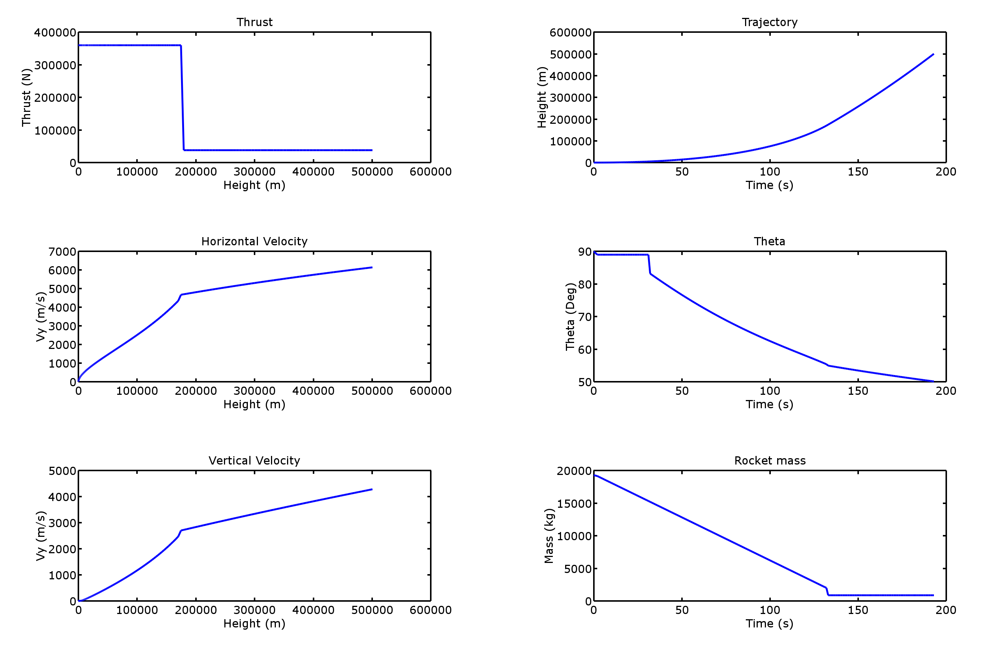

# rocket-preliminary-design-tool
A tool to test the parameter set for a preliminary rocket with an orbital trajectory in Octave.

You can choose between a simple incremental calculation and the finite difference methode.

## preassumptions
- no atmospheric drag
- gravity
- fuel mass flow
- 2 stages
- no earth rotation

