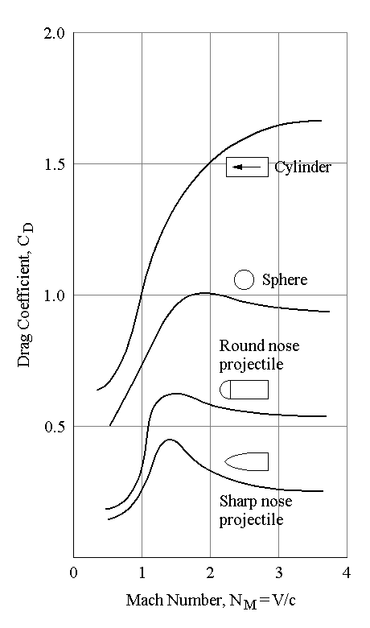

# rocket-preliminary-design-tool
A tool to test the parameter set for a preliminary rocket with an orbital trajectory in Octave.

You can choose between a simple incremental calculation and the finite difference methode.

## Physical calculations
In general the rockets movement in space is determined by its performance parameters and the characteristics of the fluid (air or wind) which it is trapped in.
Always keep in mind, that the fluid "air" is compressible. Therefor drag calculations are not trivial.  

### Drag
The force of the applied drag to the rocket considers the condition of the fluid which the rocket is located, the area of the rocket which is facing the fluid stream and the rocket's drag coefficient.
#### general dependencies

The drag force equals the rocket's drag coefficient times the stagnating (or dynamic) pressure (which equals the total pressure minus static pressure) and the area of the rocket which "facing the wind" (area facing the stream of fluid).

##### stagnating pressure
The stagnating pressure is directly related to the fluids velocity and density. The velocity is time-related and the density decreases over the altitude. Both parameters will be necessary for the calculation.

##### drag coefficient
The drag coefficient is usually determined with wind canal tests of a modal rocket. In the code it will be set to a default value of 0.3 with subsonic speeds and 0.5 supersonic. It only depends on the nose shape and the possible aerodynamic stabilizers facing the fluid.

source: http://www.airplanesandrockets.com/rockets/images/model-rocketry-new-look-american-modeler-may-1961-2.jpg

source: http://www.braeunig.us/space/cd.htm

The pressure is only related to the rocket's altitude. The International Standard Atmosphere model (ISA) will be applied for the calculations.

source: https://en.wikipedia.org/wiki/Barometric_formula#/media/File:Pressure_air.svg

The area facing the stream of the fluid is related to the angle of attack (theta). The Angle of attack is also time related but will be controlled. The geometric relation is outlined in the sketch below presuming no cone is attached to the fuselage. This represents the worst case.  

